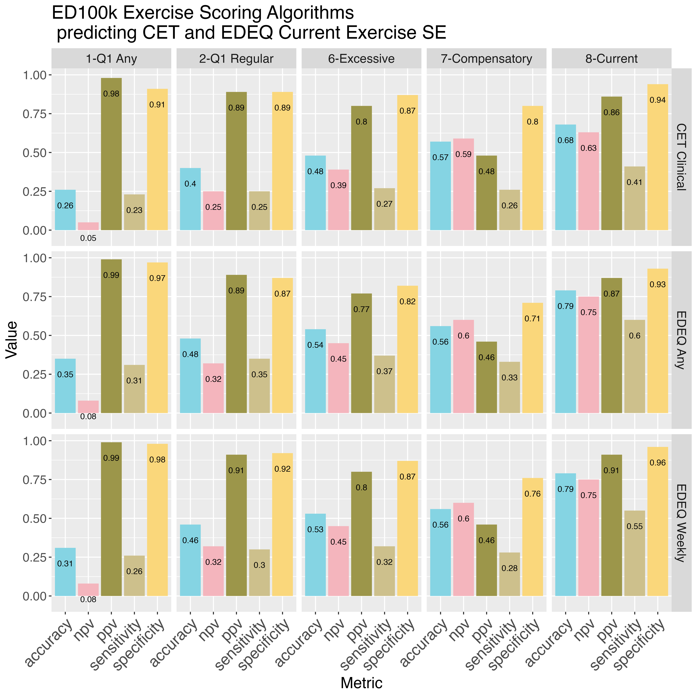
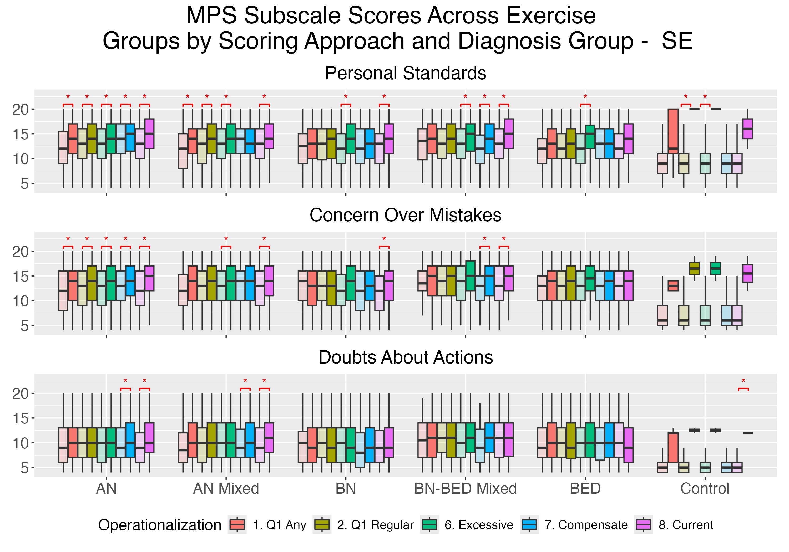

Scoring algorithms are provided in @tbl-scoring. Sociodemographic characteristics of the sample and frequency of eating disorder diagnosis groups for each country are presented in Supplemental @tbl-tbl1.

## Preliminary Aim - Develop a scoring algorithm

The ED100k included 12 questions assessing maladaptive exercise (see Supplemental @fig-flowchart) The first question, which all participants were asked, inquires as to whether individuals *ever* exercised to intentionally control weight and shape (Q1). Only those who endorsed EVER Exercising to intentionally control weight or shape were asked to respond to two additional questions which asked about exercise in more detail, including two questions (Q2, Q3) about whether individuals ever felt compelled to exercise and whether they felt uneasy or distressed if unable to exercise. In a third step, those who reported affirmatively to Q1 and 'Yes' to *either* Q2 or Q3 were additionally asked three questions (Q4-Q6) about whether exercise interfered with life activities or diet, along with questions regarding the onset (Q7), duration (Q8), and frequency (Q9) of their maladaptive exercise, along with whether they engaged in the behavior currently (Q10) and the last age at which they engaged in the behavior (Q11). In a separate section, participants who endorsed episodes of binge eating with loss of control were asked whether they had 'exercised excessively' specifically to *compensate* for episodes of binge eating or overeating (Q12). During recoding, those (NZ n = 833 ; SE n = 2716; USA n = 1710 who reported no to Q1 were marked as '0' for all follow-up questions, with the exception of ages (Q10-11), which were retained as missing. Those who reported that they had engaged in exercise to for weight and shape control but 'No' to both Q2 & Q3 (NZ n = 135; SE n = 143; USA n = 198) were marked as '0' for Q4-Q9. Thos who did not endorse episodes of binge eating were marked as '0' for Q12. Frequencies for the 10 dichotomous/ordinal exercise items with imputed values based on skip patterns (see scoring) are provide in Supplemental @tbl-ed100kItems. Median age of onset for those reporting any compulsive exercise in the sample was NZ: 16 years; SE: 15 years; USA: 16 years and the median age of last report of compulsive exercise was NZ: 22 years; SE: 23 years; USA: 23 years. Among those who reported any compulsive exercise, NZ: 52.71%; SE: 47.51%; USA: 46.94% reported that this was an ongoing symptom.

## Aim 1. Evaluate patterns of response across multiple scoring methods -- to identify the degree to which scoring methods requiring different item-level endorsement, consistent with varying definitions of maladaptive exercise, result in overlapping membership or capture distinct groups

@fig-heatmap presents the proportion of the full sample along with sub-samples (horizontal axis) meeting criteria for each (sub)construct (vertical axis), with the overall prevalence of each construct presented on the off diagonal.

::: {.cell}
::: {.cell-output-display}
{#fig-heatmap}
:::
:::

### Accuracy of Q1 (Approaches 1-2) to detect further maladaptive exercise symptoms

Overall, there was high convergent validity for Q1 with Q2-Q6. Specifically, individuals eating disorders who endorse Q1 Any (Approach #1) are highly likely to confirm either feeling compelled to exercise or distressed when unable to exercise (#3; high positive predictive value). As hypothesized, Q1 Any (#1) had more moderate positive predictive value for approaches #4-7 (compulsive/driven \[narrow\], addictive, excessive, compulsive).

Among those meeting Q1 Regular (#2), individuals were likely to engage in this behavior for a substantive period of time -- NZ: 97.19%; SE: 98.23%; USA: 98.53% of those meeting Q1 Regular reported maladaptive exercise for a duration of \> 3 months; a time period of equivalent to diagnostic levels of other intentional weight control behaviors. Those meeting Q1 Regular were also highly likely to report symptoms consistent with definitions of both compulsive/driven (high positive predictive value for #3-4), addictive (high positive predictive value for #5) exercise. Q1 Regular positive predictive value for predicting excessive exercise (#6) was also high, but less so than approaches #3-5.

Supplemental @fig-Q1sensitivity reports full metrics on the utility of Q1 Any and Q1 Regular to capture definitions in approaches #3-8. The sensitivity and negative predictive values of Q1 Any detection of approaches #3-6 were forced to 1.0 by definition. Overall accuracy metrics of Q1 Any predicting #3, and Q1 Regular predicting #4-5 suggest that additional criteria added to these approaches are not necessary for defining maladaptive exercise that (1) verifies compulsive/driven symptoms and (2) identifies significant duration and interference with life and/or health among individuals with EDs. Overall, the vast majority of individuals with eating disorders who reporting regular exercise for weight loss to control weight and shape in Q1 go on to report that this exercise was compulsive and that they also experienced life interfering sequelae of this behavior. Further, regarding specific addictive exercise symptoms, the modal number of exercise interference items was all 3.

While Q1 accurately defined those experiencing compulsive and addictive exercise (Approaches #3-5) with little additional information provided from follow-up questions, the same was not true for excessive exercise (#6) and compensatory exercise (#7) -- additional questions may be necessary to define excessive and compensatory exercise with the highest levels of accuracy, and endorsement of these constructs do not entirely overlap with endorsement of other maladaptive exercise symptoms. While positive predictive value and overall accuracy for Q1 Any predicting compensatory accuracy (#7) were moderate, suggesting that not all individuals who endorse Q1 Any also endorse compensatory exercise, sensitivity was high -- almost all of those who endorsed compensatory exercise also endorsed Q1 Any. Overall accuracy of both Q1 Any and Q1 Regular in predicting compensatory exercise (#7) was moderate, again suggesting that compensatory exercise occurs in only a subsample of those with maladaptive exercise, and that this question provides utility in the scale. For further analysis in Aims 2-3, scoring approaches #1,2,6,7, & 8 are retained, as they provide unique and discriminable information about maladaptive exercise patterns.

## Aim 2. Demonstrate Prevalence of Maladaptive (Broad), Compulsive, Addictive, Excessive, and Compensatory Exercise across Diagnostic Groups

Rates of addictive, compensatory, compulsive, excessive, and regular compulsive exercise across diagnostic groups are presented in @fig-dxgroups. History of addictive, regular compuslive, and excessive exercise were all highest in an absolute sense among groups reporting history of AN. History of Compulsive Exercise was reported most frequently in the AN, AN-Mixed Diagnosis, and BN groups, with the majority reporting at least some history of this behavior. Output from contrasts between all diagnostic groups are presented in Supplemental @tbl-dxcontrasts. Bonferroni adjusted p-values are reported accounting for 10 contrasts within each constructs Overall, groups differed significantly across all constructs, with the AN group reporting less compensatory exercise, but higher levels of all other exercise relative to BN and BED groups. The AN-Mixed group reported similar levels of all constructs to AN, with the exception of compensatory exercise, in which the AN Mixed group reported greater likelihood of to engagin in compensatory exercise. The BN group was more likely than BED and BN-BED Mixed groups to report all constructs, and the BN-BED group was more likely to report all constructs relative to the BED group.

::: {.cell}
::: {.cell-output-display}
{#fig-dxgroups}
:::
:::

## Aim 3. Evaluate Convergent and Discriminant Validity between ED100k Scoring Approaches and: Current Compulsive Exercise, Perfectionism, and OCD symptoms

### CET sand EDEQ driven exercise

Confusion matrix components for ED100k scoring approaches and current compulsive/driven exercise endorsement assessed by 1. meeting CET clinical cutoff and 2. endorsement of EDEQ (any and at least weekly) driven exercise in the past 28 days are presented in Supplemental @fig-npv. As hypothesized, approaches #1, 2, and 8 had a high negative predictive value: those who did not endorse any history of, rare history of, or no current maladaptive exercise were unlikely to endorse current compulsive or driven exercise on the CET and EDEQ. negative predictive values for both CET clinical cutoff and weekly or more EDEQ driven exercise (4x or more over the past 28 days) were \> 0.9. negative predictive values were slightly lower for reports of any EDEQ driven exercise over the past 28 days (\~ 0.85), indicating that some individuals who endorse no history of compulsive exercise may engage in this behavior at relatively low frequency.

Accuracy of #1, #2, #6, and #7 in relation to current measures of driven/compulsive exercise were moderate, indicating only a portion of individuals who reported *history* of maladaptive exercise -- via various operationalizations - on the ED100k were engaging in compulsive/driven at the time of assessment. positive predictive value was highest for #1 (\>0.95), and in a moderate-to-high range for #2,6,7, & 8, indicating that a portion of individuals who report current maladaptive exericse on the CET or EDEQ do not report history of driven exercise on the ED100k operationalizations #2, 6, 7, or 8. positive predictive value for compensatory exericse was lowest, which was expected given that the CET and EDEQ do not capture compensatory motivations. Overall accuracy metrics were highest for scoring method #8 (current), and generally supporting the ED100k current exercise operationalization as a rough indicator of current compulsive exercise.

Overall, NZ: 18.73%; SE: 31.76%; USA: 21.8% of the sample reported no history of maladaptive exercise, NZ: 38.43%; SE: 35.82%; USA: 41.49% reported a history of maladaptive exercise that was not current, and NZ: 42.84%; SE: 32.42%; USA: 41.49% reported current maladaptive exercise.

Boxplots with median standardized scores on all CET subscales along with CET total score is presented in @fig-CETEDEQ-1, and a plot showing the median frequency of EDEQ driven exericse episodes in the past 28 days is presented in @fig-CETEDEQ-2.

::: {#fig-CETEDEQ .cell}
::: {.cell-output-display}
{#fig-CETEDEQ-1}
:::

::: {.cell-output-display}
{#fig-CETEDEQ-2}
:::

Median (+ 25th-75th percentile range) within-cohort standardized CET subscale scores and EDEQ driven exercise frequency across those reporting no maladaptive exercise, history of maladaptive exercise only (#1, but not 8), and current maladaptive exercise (#8) on the ED100k
:::

To formally test the hypothesis that those with reporting ED100k current maladaptive exercise would also report the highest scores on the CET, we completed a series of ANOVAs comparing those with reporting no maladaptive exercise, history of maladaptive exercise only (Meeting Scoring Approach #2 but not #8), and current maladaptive exercise (Meeting Approach #8) on current CET scores.

Supplemental @tbl-CETANOVA reports ANOVA output for each CET subscale, comparing across the three groups of individuals who report no maladaptive exercise, maladaptive exercise history but not current maladaptive exercise (#2 but NOT #8), and both history and current maladaptive exercise (#8) on the ED100k. All omnibus tests reach significance. Supplemental @tbl-CETcontrasts presents specific contrasts between each group, using a Tukey's HSD approach with an adjusted alpha to compute confidence intervals of 0.0028 - accounting for 18 contrasts. All contrasts reach significance (confidence intervals of differences not overlapping '0'). Cohen's D effects suggest a pattern of moderate effect size when comparing those with no history of maladaptive exercise to those with a history, but not current, maladaptive exercise and when comparing those with history vs. current maladaptive exercise. Comparison of those with no history of maladaptive exercise vs. current maladaptive exercise (#8) consistently demonstrated large effects. For all subscales, except for the (lack of) enjoyment subscale, effects indicated that those with current maladaptive exercise scored highest, while those with no history of maladaptive exercise scored the highest on the lack of exercise enjoyment subscale.

The proportion of individuals meeting the clinical cutoff for current compulsive exercise on the CET varied as expected by endorsement of historical and current endorsement of maladaptive exercise on the ED100k. Only NZ: 7.34%; SE: 1.47%; USA: 4.62% of individuals who reported no history of maladaptive exercise met current CET clinical cutoff, while NZ: 19.36%; SE: 6.28%; USA: 18.45% of those reporting history, but not current maladaptive exercise (#2 but not #8) met clinical cutoff on the CET, and NZ: 60.61%; SE: 40.64%; USA: 63.51% of individuals meeting current maladaptive exercise (#8) on the ED100k met clinical cutoff for maladaptive exercise on the CET. Using a multinomial logistic regression approach with 'No Maladaptive Exercise History' on the ED100k coded as the reference category, those reporting maladaptive exercise history, but not current maladaptive exercise had an odds ratio of NZ: 3.03; SE: 4.48; USA: 4.67 and those reporting current maladaptive exercise had an odds ratio of NZ: 19.42;SE: 45.75; USA: 35.95, indicating significant convergent validity of reports of current maladaptive exercise on the ED100k and meeting clinical cutoff on the 24-item CET.

Regarding the number of days in the past 28 that participants reported engaging in driven exercise on the EDEQ, outcomes were zero-inflated in the 'No History of Maladaptive Exercise' and 'History but No Current Maladaptive Exercise' groups. A zero-inflated Poisson regression model compared those with "History, but Not Current' and those with 'Current Maladaptive Exercise' to the 'No History of Maladaptive Exercise' (reference) group on number of days with driven exercise in the past month. Results are presented in @tbl-EDEQZin (including odds ratios (ORs) for the zero portion of the model and incident risk ratios (IRRs) for the count portion). Results indicate that those who report current maladaptive exercise on the ED100k are less likely to have zero values for EDEQ-assessed exercise in the past 28 days, and report higher counts of exercise days when they do exercise. Those reporting history of, but not current, maladaptive exercise on the ED100k are similarly less likely to report zero days of driven exercise on the EDEQ as compared to those who report no history of maladaptive exercise, though the count portion of the model indicates that those reporting history, but not current, maladaptive exercise are reporting low numbers of exercise days when it occurs, lower than those who report no history of maladaptive exercise.

### OCD Symptoms and Perfectionism

In addition to convergent validity across current exercise measures, we also examined both convergent and discriminant validity by examining ED100k scoring approaches on subscales of the Frost MPS indexing maladaptive perfectionism along with subscale and total scores for the OCI-R.

::: {.cell}

:::

Graphs depicting means and standard deviations for OCI total and subscale scores within diagnostic groups are presented in Supplemental @fig-OCI. A table showing t-tests and Cohen's D effect sizes for comparisons of subscale and total OCI scores within diagnostic groups is presented in Supplemental @tbl-OCI. Effect sizes were small-to-moderate (NZ Range = 0.002-0.435; Median = 0.125; SE Range = 0.005-0.453; Median = 0.136; USA Range = 0.003-0.442; Median = 0.165; ).

::: {.cell}

:::

Graphs depicting means and standard deviations for MPS total and subscale scores within diagnostic groups are presented in Supplemental @fig-MPS. A table showing t-tests and Cohen's D effect sizes for comparisons of MPS subscale scores within diagnostic groups is presented in Supplemental @tbl-MPS. Cohen's D effect sizes ranged from small-to-moderate (NZ Range = 0.004-0.592; Median = 0.172; SE Range = 0.002-0.543; Median = 0.161; USA Range = 0-0.585; Median = 0.219).

# Supplement

## Figures

::: {.cell}
::: {.cell-output-display}
{#fig-flowchart}
:::
:::

::: {#fig-Q1sensitivity .cell layout-ncol="1"}
::: {.cell-output-display}
{#fig-Q1sensitivity-1}
:::

::: {.cell-output-display}
{#fig-Q1sensitivity-2}
:::

::: {.cell-output-display}
{#fig-Q1sensitivity-3}
:::

Accuracy of Q1 Any (#1) and Q1 Regular (#2) in detecting groups defined in approaches 3-8. Higher values represent greater validity/higher accuracy
:::

::: {#fig-npv .cell layout-ncol="1"}
::: {.cell-output-display}
{#fig-npv-1}
:::

::: {.cell-output-display}
{#fig-npv-2}
:::

::: {.cell-output-display}
{#fig-npv-3}
:::

Confusion matrix components of ED100k Exercise Scoring Apporoaches vs. current CET and EDEQ exercise
:::

::: {#fig-OCI .cell layout-ncol="1"}
::: {.cell-output-display}
{#fig-OCI-1}
:::

::: {.cell-output-display}
{#fig-OCI-2}
:::

::: {.cell-output-display}
{#fig-OCI-3}
:::

OCI Means across diagnosis groups and ED100k exercise scoring criteria. Note - \*significant at FDR-corrected p-value. Lighter colors represent samples that do NOT meet scoring criteria; Darker colors represent samples that DO meet scoring criteria within each operationalization. Comparisons completed for those who do vs. do not meet scoring criteria within scoring approach and diagnostic group
:::

::: {#fig-MPS .cell layout-ncol="1"}
::: {.cell-output-display}
{#fig-MPS-1}
:::

::: {.cell-output-display}
{#fig-MPS-2}
:::

::: {.cell-output-display}
{#fig-MPS-3}
:::

MPS subscale means across diagnosis groups and Scoring Operationalizations. Note - \*significant at FDR-corrected p-value. Lighter colors represent samples that do NOT meet scoring criteria; Darker colors represent samples that DO meet scoring criteria within each operationalization. Comparisons completed for those who do vs. do not meet scoring criteria within scoring approach and diagnostic group
:::

## Tables (See Supplemental_Tables.xlsx)

::: {#tbl-scoring .cell tbl-cap='Algorithm defining exercise-related constructs in the ED100k'}

:::

::: {#tbl-tbl1 .cell tbl-cap='Sample Descriptives. Categorial variables presented as N and percent of sample endorsing each category. Continuous variables presented as mean (SD).'}

:::

::: {#tbl-ed100kItems .cell tbl-cap='Item-level descriptives for ED100k Exercise Items (Cases Only)'}

:::

::: {#tbl-dxcontrasts .cell tbl-cap='Odds Ratios for contrasts between all diagnostic groups within exercise construct'}

:::

::: {#tbl-CETANOVA .cell tbl-cap='Sample Descriptives. Categorial variables presented as N and percent of sample endorsing each category. Continuous variables presented as mean (SD).'}

:::

::: {#tbl-CETcontrasts .cell tbl-cap='Sample Descriptives. Categorial variables presented as N and percent of sample endorsing each category. Continuous variables presented as mean (SD).'}

:::

::: {#tbl-EDEQZin .cell tbl-cap='Zero-inflated Model Coefficients for ED100k Compulsive Exercise Predicting EDEQ Driven Exercise Days (past 28 days)'}

:::

::: {#tbl-OCI .cell tbl-cap='t-test output comparing OCI subscales and total scores within diagnostic groups and scoring approach'}

:::

::: {#tbl-MPS .cell tbl-cap='t-test output comparing those with and without compulsive exercise on MPS subscales and within diagnostic groups'}

:::

::: {.cell}

:::
